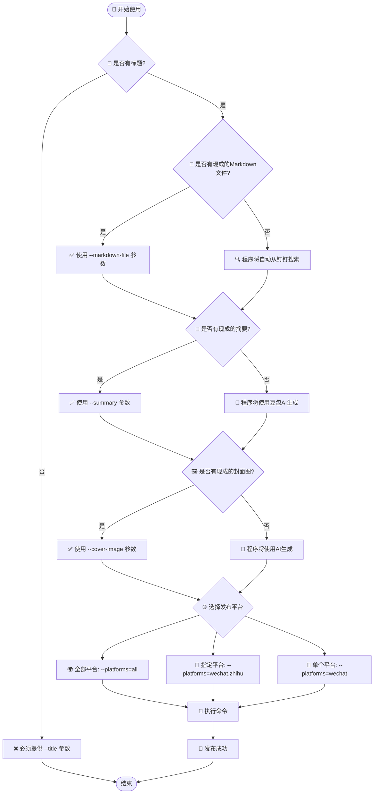
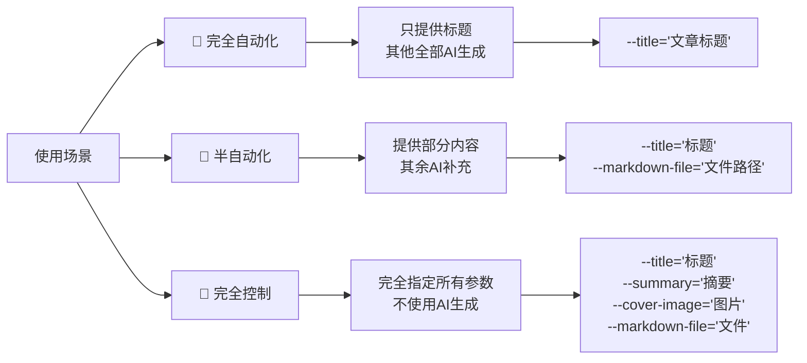
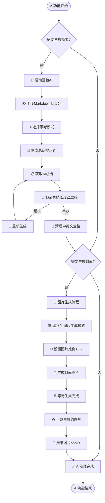
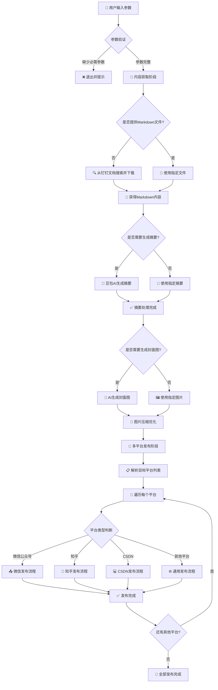
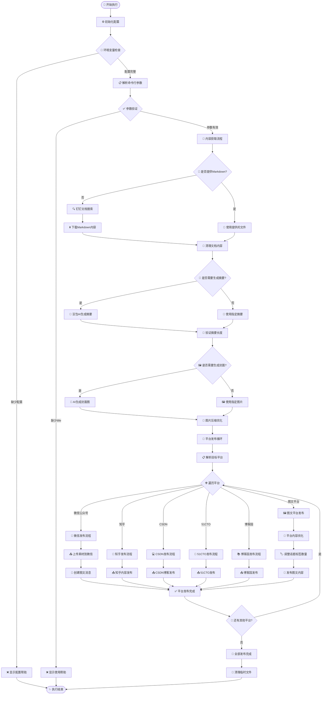
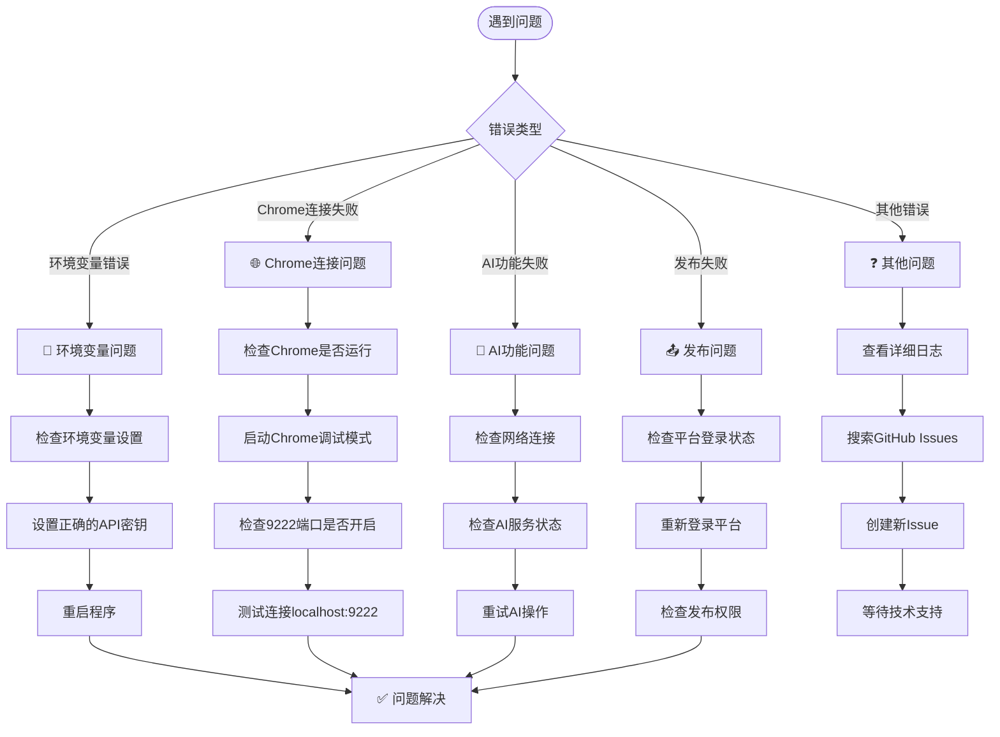

# Playwright自动化项目

这是一个基于Playwright的社交媒体自动化发布系统，集成了AI功能和多平台发布能力。

## ✨ 主要功能

- 🚀 **多平台自动发布**：支持微信公众号、知乎、CSDN、51CTO、博客园、抖音、快手、小红书等平台
- 🤖 **AI内容生成**：集成豆包AI和Gemini（二者选一），支持文章总结和图片生成
- 📄 **智能内容处理**：自动从钉钉文档获取内容，智能清理和格式化
- 🎯 **字数统计优化**：自动优化文本长度，符合各平台要求
- 🔧 **模块化设计**：独立的SDK和工具模块，易于维护和扩展

## 📁 项目结构

```
playwright-automation/
├── 📁 dingtalk_sdk/                    # 钉钉API SDK模块
│   ├── dingtalk_sdk.py                # 主要SDK代码
│   ├── example_usage.py               # 使用示例
│   ├── requirements.txt               # 依赖包列表
│   └── README.md                      # SDK详细文档
├── 📁 wechat_mp_sdk/                  # 微信公众号SDK模块
│   ├── wechat_mp_sdk.py               # 主要SDK代码
│   ├── example_usage.py               # 使用示例
│   └── README.md                      # SDK详细文档
├── 📁 markdown_cleaner_sdk/               # Markdown清理工具
│   ├── markdown_cleaner.py            # 主要清理代码
│   ├── example.py                     # 使用示例
│   └── README.md                      # 工具文档
├── 📁 word_counter_sdk/               # 字数统计SDK模块
│   ├── simple_word_counter.py         # 主要统计代码
│   ├── example_usage.py               # 使用示例
│   └── README.md                      # SDK详细文档
├── 📄 test_social_media_automatic_publish.py  # 🎯 主要发布脚本
├── 📄 doubao_ai_image_generator.py     # 豆包AI图片生成模块
├── 📄 conftest.py                      # pytest配置文件
├── 📄 pyproject.toml                   # 项目配置文件
└── 📄 README.md                        # 项目说明（本文件）
```

## 🔧 核心模块

### 1. 社交媒体自动发布系统 (`test_social_media_automatic_publish.py`)

**主要功能：**
- 🌐 **多平台支持**：微信公众号、知乎、CSDN、51CTO、博客园、抖音、快手、小红书等
- 📝 **智能内容处理**：自动从钉钉文档获取内容并格式化
- 🤖 **AI集成**：支持豆包AI生成文章总结和封面图片，并自动将生成的封面图插入到钉钉文档的首行
- 🎯 **标签管理**：根据平台特性自动调整话题标签数量
- 📊 **字数优化**：自动检查和优化文本长度

**支持的平台：**
- 微信公众号（图文消息）
- 知乎（文章发布）
- CSDN（博客发布）
- 51CTO（技术博客）
- 博客园（技术文章）
- 抖音（图文消息）
- 快手（图文消息）
- 小红书（图文消息）
- 哔哩哔哩（专栏）

### 2. 钉钉API SDK (`dingtalk_sdk/`)

专门用于封装钉钉开放平台服务端API的Python SDK。

**主要功能：**
- 🔐 自动获取和刷新access_token
- 👤 查询用户信息（根据userid获取unionid）
- 🔍 搜索钉钉知识库文档
- 📄 获取文档详细信息（包括URL）

### 3. AI功能模块

#### 豆包AI图片生成 (`doubao_ai_image_generator.py`)
- 🎨 从Markdown文件生成文生图提示词
- 🖼️ 自动生成文章封面图片
- 📐 支持多种图片比例（16:9、1:1、4:3）
- 🎯 支持思考模式、极速模式等AI模式选择

#### AI文章总结功能
- 📝 使用豆包AI生成120字以内的文章总结
- 🔍 自动从剪贴板读取内容
- ✅ 智能长度验证和优化
- 🔗 集成在主发布脚本中

#### Gemini图片生成功能（可选，默认使用豆包AI）
- 🌟 使用Google Gemini生成高质量图片
- 📁 自动下载到指定目录
- 🎯 可作为封面图片自动生成选项

### 4. 微信公众号SDK (`wechat_mp_sdk/`)

**主要功能：**
- 🔑 自动获取和管理access_token
- 📤 上传永久素材（图片、语音、视频等）
- 🛡️ 完整的错误处理机制
- 💡 简单易用的API设计

### 5. 辅助工具模块

#### 字数统计SDK (`word_counter_sdk/`)
- 📊 精确的字符数统计
- 🔧 中英文空格智能处理
- ⚠️ 超长文本自动警告
- 🎯 120字限制验证（适配微信公众号）
- 🚀 便捷的API设计和丰富示例

#### Markdown清理工具 (`markdown_cleaner_sdk/`)
- 🧹 删除包含指定关键字的行
- 🔍 支持精确匹配、包含匹配和正则表达式
- 💾 自动备份原文件
- 📝 详细的操作日志

## 🚀 快速开始

### 环境要求

- **Python 3.13+**
- **Playwright** （用于浏览器自动化）
- **Chrome/Chromium** （若连接到电脑中已经安装的Chrome浏览器，则需要开启调试端口）

### 安装步骤

1. **克隆项目**
```bash
git clone https://github.com/iamtornado/playwright-automation.git
cd playwright-automation
```

2. **安装依赖**
```bash
# 使用uv（推荐，更快）
# 关于playwright的详细介绍，可参考此文：https://docs.dingtalk.com/i/nodes/gpG2NdyVX3Z65nZ2sqvmaPQgWMwvDqPk
uv sync
```

3. **安装chromium浏览器**
```bash
uv run playwright install chromium
```

4. **配置环境变量**

创建 `.env` 文件或设置系统环境变量：

```bash
# 钉钉API配置
# 可以参考此文：https://alidocs.dingtalk.com/i/nodes/pGBa2Lm8aG3qEO3ws0zZAeLLVgN7R35y
DINGTALK_APP_KEY="your_app_key"
DINGTALK_APP_SECRET="your_app_secret" 
DINGTALK_USER_ID="your_user_id"

# 微信公众号API配置
# 可以参考此文：https://docs.dingtalk.com/i/nodes/GZLxjv9VGqAl6KAPs7v3m4gO86EDybno
WECHAT_APP_ID="your_app_id"
WECHAT_APP_SECRET="your_app_secret"
```

5. **启动Chrome调试模式（仅在需要连接到电脑中已经安装的Chrome浏览器时需要，playwright默认使用的是内置的chromium）**
```bash
# Windows
start chrome --remote-debugging-port=9222 --user-data-dir=<此处填写你的浏览器用户数据目录，不能用默认的，必须要额外创建一个新的文件夹，否则会报错>

# macOS
/Applications/Google\ Chrome.app/Contents/MacOS/Google\ Chrome --remote-debugging-port=9222 --user-data-dir=<此处填写你的浏览器用户数据目录，不能用默认的，必须要额外创建一个新的文件夹，否则会报错>

# Linux
google-chrome --remote-debugging-port=9222 --user-data-dir=<此处填写你的浏览器用户数据目录，不能用默认的，必须要额外创建一个新的文件夹，否则会报错>
```

## 📖 使用说明

### 参数决策流程图



### 使用场景示例



### 主要功能使用

#### 1. 社交媒体自动发布示例

```bash
# 基本使用 - 发布到所有平台
# 特别注意：必须要添加--headed参数，这会开启浏览器可视化模式，如果不加此参数，则默认为headless模式，无法看到浏览器操作过程，而且脚本执行过程中会报错。
uv run pytest -s --headed --video on --screenshot on --full-page-screenshot test_social_media_automatic_publish.py --title="文章标题" --author="作者名"

# 指定特定平台
uv run pytest  -s --headed --video on --screenshot on --full-page-screenshot test_social_media_automatic_publish.py --title="文章标题" --platforms="wechat,zhihu,csdn"

# 使用自定义参数（Linux）
uv run pytest  -s --headed --video on --screenshot on --full-page-screenshot test_social_media_automatic_publish.py \
  --title="AI技术分享" \
  --author="tornadoami" \
  --summary="这是一篇关于AI技术的文章" \
  --tags="AI,机器学习,深度学习" \
  --markdown-file="path/to/article.md" \
  --cover-image="path/to/cover.jpg"

# 使用自定义参数（Windows）
uv run pytest  -s --headed --video on --screenshot on --full-page-screenshot test_social_media_automatic_publish.py `
  --title="AI技术分享" `
  --author="tornadoami" `
  --summary="这是一篇关于AI技术的文章" `
  --tags="AI,机器学习,深度学习" `
  --markdown-file="path/to/article.md" `
  --cover-image="path/to/cover.jpg"

# 使用自定义参数的另外一个示例（Windows）
uv run pytest `
    -s `
    --headed `
    --video on `
    --screenshot on `
    --backup-browser-data false `
    --full-page-screenshot `
    --tracing on `
    ./test_social_media_automatic_publish.py `
    --platforms 51cto,cnblogs,bilibili_newspic,douyin_newspic,xiaohongshu_newspic,kuaishou_newspic `
    --tags auto `
    --summary "本文讲MobaXterm远程Ubuntu的四种方法：SSH直接连（部分应用打不开）、SSH+Gnome（体验佳）、VNC（不推荐）、RDP（推荐，功能全）。提Ubuntu默认Wayland比X11好，及远程设置注意事项。" `
    --url "https://alidocs.dingtalk.com/i/nodes/nYMoO1rWxa7nvZ7GubrbgPP4V47Z3je9" `
    --markdown-file "D:/Users/14266/Downloads/mobaxterm远程桌面访问ubuntu desktop心得.md" `
    --cover-image "D:/Users/14266/Downloads/mobaxterm远程桌面访问ubuntu desktop心得封面图.png" `
    --short-title "mobaxterm远程桌面方法汇总" `
    --title "mobaxterm远程桌面访问ubuntu desktop心得"
```

**支持的命令行参数：**
- `--title`：文章标题（必填）
- `--author`：作者名称（默认：tornadoami）
- `--summary`：文章摘要（可选，不指定则使用豆包AI生成）
- `--platforms`：发布平台（默认：all，可选：wechat,zhihu,csdn,51cto,cnblogs,bilibili_newspic,douyin_newspic,xiaohongshu_newspic,kuaishou_newspic）
- `--tags`：话题标签，用逗号分隔
- `--url`：原文链接（可选，不指定则从钉钉文档自动获取）
- `--short-title`：短标题（可选，用于图文平台，如不指定则自动生成）
- `--markdown-file`：Markdown文件路径（可选，不指定则从钉钉文档获取，这种情况下title的值就是钉钉文档的标题）
- `--cover-image`：封面图片路径（可选，不指定则使用豆包AI生成）
- `--user-data-dir`：浏览器数据目录路径（可选，默认：D:/tornadofiles/scripts_脚本/github_projects/playwright-automation/chromium-browser-data，注意默认值是我电脑环境，你需要根据你的电脑环境来设置）
- `--backup-browser-data`：是否备份浏览器数据，可选值：true/false，默认为true

#### 2. AI功能使用

##### AI功能处理流程



**豆包AI文章总结：**
AI文章总结功能已集成在主发布脚本中，通过 `--summary` 参数控制：
```bash
# 使用AI自动生成总结（不指定--summary参数）
uv run pytest  -s --headed --video on --screenshot on --full-page-screenshot test_social_media_automatic_publish.py --title="钉钉文档标题"

# 使用自定义总结
uv run pytest  -s --headed --video on --screenshot on --full-page-screenshot test_social_media_automatic_publish.py --title="钉钉文档标题" --summary="自定义总结内容"
```

**利用豆包AI生成封面图片：**
图片生成功能在doubao_ai_image_generator.py模块中，通过 `--cover-image` 参数控制：
```bash
# 使用AI自动生成封面图片（不指定--cover-image参数）
uv run pytest  -s --headed --video on --screenshot on --full-page-screenshot test_social_media_automatic_publish.py --title="钉钉文档标题"

# 使用自定义封面图片
uv run pytest  -s --headed --video on --screenshot on --full-page-screenshot test_social_media_automatic_publish.py --title="钉钉文档标题" --cover-image="path/to/image.jpg"
```

#### 3. 钉钉SDK使用

```python
from dingtalk_sdk import create_sdk

# 创建SDK实例
sdk = create_sdk("your_app_key", "your_app_secret")

# 搜索文档并获取详细信息
documents = sdk.search_and_get_document_details("关键词", "operator_id")

for doc in documents:
    print(f"标题: {doc.title}")
    print(f"URL: {doc.url}")
```

#### 4. 字数统计SDK

```python
from word_counter_sdk import validate_and_clean_text, quick_count

# 验证和清理文本
result = validate_and_clean_text("你的文本内容", max_length=120)
print(f"处理结果: {result['message']}")
print(f"清理后文本: {result['cleaned_text']}")

# 快速获取字符数
count = quick_count("测试文本")
print(f"字符数: {count}")
```


## 🛠️ 开发指南

### 项目架构

#### 核心架构图



#### 详细处理流程



### 代码规范

- ✅ 遵循PEP8标准
- 🏷️ 使用类型提示（Type Hints）
- 📝 添加详细的文档字符串
- 🧪 编写单元测试
- 🔧 使用现代Python特性（3.13+）


## ⚠️ 注意事项

### 使用前必读

1. **环境配置**：确保已正确设置所有必需的环境变量
2. **浏览器要求**：Chrome需要以调试模式启动
3. **网络要求**：需要稳定的网络连接访问各个平台
4. **API限制**：注意各平台的API调用频率限制
5. **内容审核**：确保发布内容符合各平台的内容政策

### 常见问题

#### 故障排除流程图



#### 问题解答

**Q: 为什么需要Chrome调试模式？**
A: 项目使用现有的Chrome会话来保持登录状态，避免重复登录。我还发现如果要想成功登录Google账户，则需要开启Chrome调试模式，因为chromium登录Google账号时会报错。

**Q: 如何处理验证码？**
A: 建议提前在Chrome中完成各平台的登录，项目会复用登录状态。

**Q: 支持哪些文件格式？**
A: 主要支持Markdown格式，图片支持PNG、JPG等常见格式。

**Q: AI生成失败怎么办？**
A: 检查网络连接和AI服务状态，可以手动提供摘要和封面图片作为备选方案。

**Q: 某个平台发布失败？**
A: 使用 `--platforms` 参数单独测试该平台，检查登录状态和权限设置。

## 📄 许可证

本项目采用MIT许可证。详见 [LICENSE](LICENSE) 文件。

## 🤝 贡献指南

1. 🍴 Fork 本项目
2. 🌿 创建功能分支 (`git checkout -b feature/amazing-feature`)
3. 📝 提交更改 (`git commit -m 'Add amazing feature'`)
4. 📤 推送到分支 (`git push origin feature/amazing-feature`)
5. 🔀 创建 Pull Request

## 📞 联系方式

- 📧 **微信公众号**: AI发烧友
- 💬 **我的微信号**: tornadoami
- 📝 **文档**: 查看各模块的README文件

---

**🎯 快速提示**: 首次使用建议先使用单个平台测试（如 `--platforms="zhihu"`），熟悉流程后再使用全平台自动发布功能。
