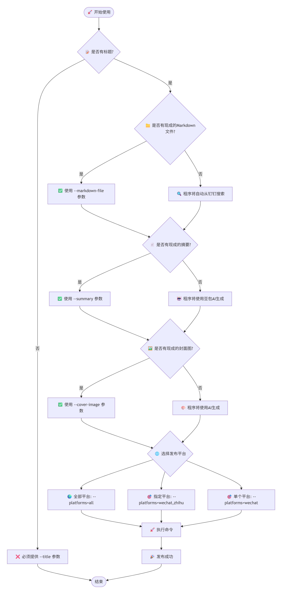
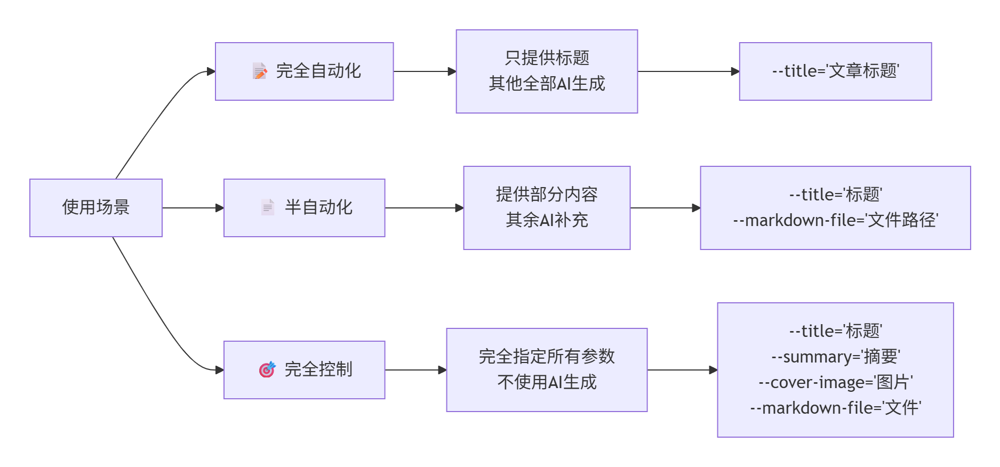
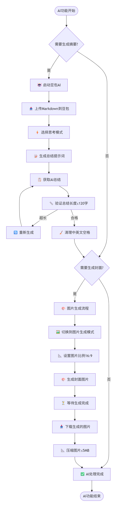
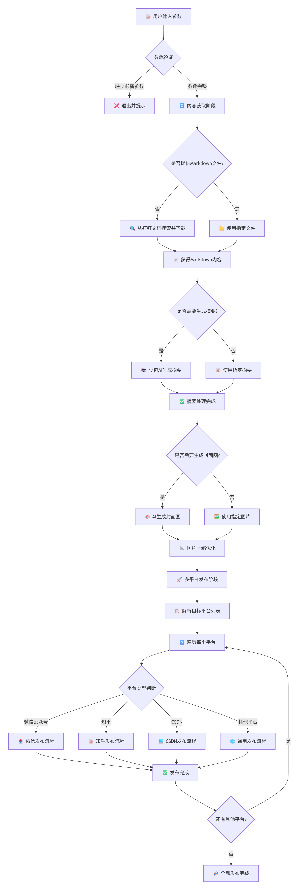
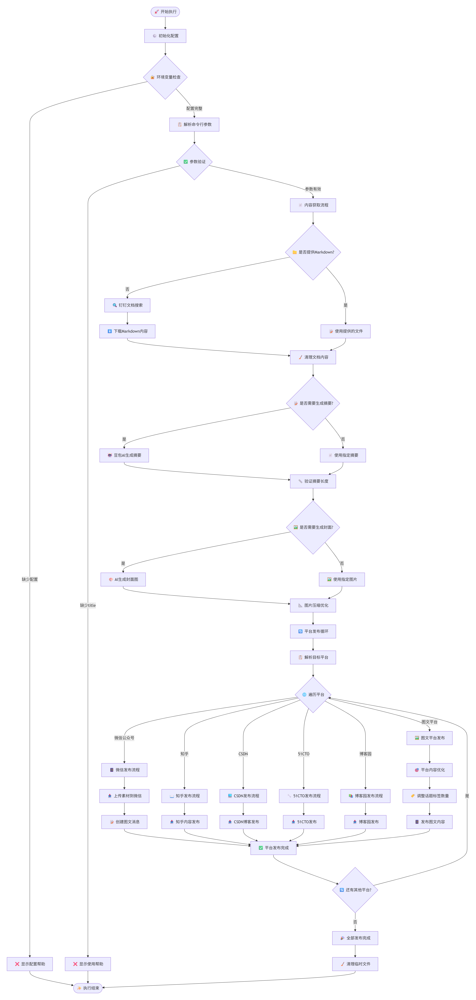
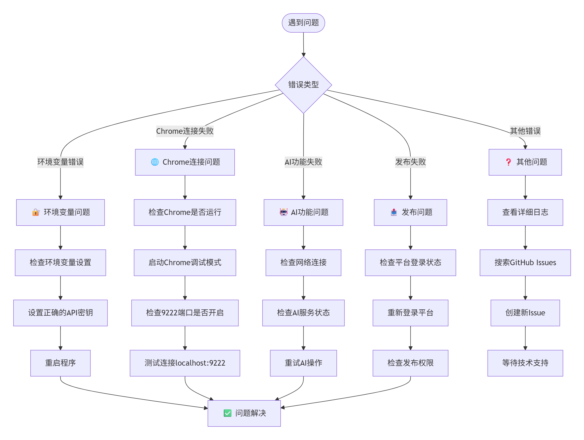

# Playwright自动化项目

这是一个基于AI+Playwright的社交媒体自动化发布系统，支持自动化将钉钉文档发布到多个社交媒体平台。也可以手动指定本地的markdown文件进行发布。

## 🎯 项目背景

作为一名技术内容创作者，我深深体会到多平台内容分发的痛点，我经常发布文章，之前的做法是先在钉钉知识库中写原始文档，然后下载为markdown文件，将markdown文件发给AI，然后AI生成封面图、话题标签、摘要和短标题，然后将封面图插入钉钉文档的首行，再次下载钉钉文档，然后发布到各个平台，对于微信公众号，还得先通过mdnice转换格式，然后复制到微信公众号编辑器中，其它平台，基本都支持直接导入markdown文件，对于抖音快手小红书等平台，还需要通过图文形式发布，整个过程枯燥无味还容易出错。

**📊 现实挑战：**
- 每次发布一篇文章，需要手动复制到8-10个平台（微信公众号、知乎、CSDN、51CTO、博客园、抖音、快手、小红书、哔哩哔哩等）
- 各平台格式要求有差异：微信公众号限制120字摘要，正文不能超过5万字，知乎支持长文，抖音快手小红书等平台不支持超过1千字的长文，需要通过图文形式发布
- 重复性工作消耗大量时间：每次发布需要1-2小时，效率低


**💡 解决方案：**
基于这些痛点，我决定开发一个智能化的内容分发系统。通过Playwright浏览器自动化技术，模拟人工操作，结合豆包AI和Gemini的强大的大模型能力，实现了：

- **一键发布**：从钉钉文档到多平台的完全自动化流程，只需指定钉钉知识库中文档的标题和要发布平台，即可自动完成发布。也可以手动指定本地的markdown文件进行发布。
- **智能适配**：AI自动生成符合各平台要求的摘要、话题标签、短标题和封面图，并自动将生成的封面图插入到钉钉文档的首行，然后自动下载更新后的钉钉文档为markdown文件，最后发布到指定平台。
- **格式优化**：自动处理字数限制、图片压缩、内容清理（我发现51CTO对于推广审核非常严格，需要对内容进行清理以便通过审核）等技术细节
- **错误处理**：完善的异常处理和重试机制，确保发布成功率
- **支持trace功能**：支持trace功能，可以查看浏览器操作过程，方便调试复盘

**🚀 价值体现：**
原本需要1-2小时的手动发布工作，现在只需几分钟即可完成，效率提升90%以上，让创作者能够专注于内容创作本身，而不是重复的发布操作。

## ✨ 主要功能

- 🚀 **多平台自动发布**：支持微信公众号、知乎、CSDN、51CTO、博客园、抖音、快手、小红书、哔哩哔哩等平台
- 🤖 **AI内容生成**：集成豆包AI和Gemini（二者选一），支持文章总结、话题标签生成、短标题生成、文章封面图生成
- 📄 **智能内容处理**：自动从钉钉文档获取内容（下载为本地markdown文件），智能清理和格式化，并自动将生成的封面图插入到钉钉文档的首行，然后自动下载更新后的钉钉文档为markdown文件，最后发布到指定平台。
- 🎯 **字数统计优化**：自动优化文本长度，符合各平台要求（主要是微信公众号的120字摘要限制和抖音小红书等平台标题限制20字以内）
- 🔧 **模块化设计**：独立的SDK和工具模块，易于维护和扩展

## 特别说明

- 当前，利用我开发的脚本将文章发布到微信公众号时，不会直接发布，而是保存为草稿，然后你需要手工发布，这是为了确保内容符合要求，而且我暂时还没有解决自动扫码的问题。另外，对于合集，代码中已经固定了合集名称为AI，这个以后我会持续优化
- 由于微信公众号cookie有效期只有几天，所以有时需要手动扫码登录，未来计划支持自动将微信公众号登录页面的二维码发送到指定邮箱，然后手动扫码登录
- 对于知乎，话题标签是固定的，为"LLM", "AI", "大模型"
- 对于csdn、51CTO、博客园、bilibili，文章的分类是固定的，未来我计划利用AI自动判断文章应该选择哪一个或哪些分类

## 📁 项目结构

```
playwright-automation/
├── 📁 dingtalk_sdk/                    # 钉钉API SDK模块
│   ├── dingtalk_sdk.py                # 主要SDK代码
│   ├── example_usage.py               # 使用示例
│   ├── requirements.txt               # 依赖包列表
│   └── README.md                      # SDK详细文档
├── 📁 wechat_mp_sdk/                  # 微信公众号SDK模块
│   ├── wechat_mp_sdk.py               # 主要SDK代码
│   ├── example_usage.py               # 使用示例
│   └── README.md                      # SDK详细文档
├── 📁 markdown_cleaner_sdk/               # Markdown清理工具
│   ├── markdown_cleaner.py            # 主要清理代码
│   ├── example.py                     # 使用示例
│   └── README.md                      # 工具文档
├── 📁 word_counter_sdk/               # 字数统计SDK模块
│   ├── simple_word_counter.py         # 主要统计代码
│   ├── example_usage.py               # 使用示例
│   └── README.md                      # SDK详细文档
├── 📄 test_social_media_automatic_publish.py  # 🎯 主要发布脚本
├── 📄 doubao_ai_image_generator.py     # 豆包AI图片生成模块
├── 📄 conftest.py                      # pytest配置文件
├── 📄 pyproject.toml                   # 项目配置文件
└── 📄 README.md                        # 项目说明（本文件）
```

## 🔧 核心模块

### 1. 社交媒体自动发布系统 (`test_social_media_automatic_publish.py`)

**主要功能：**
- 🌐 **多平台支持**：微信公众号、知乎、CSDN、51CTO、博客园、抖音、快手、小红书、哔哩哔哩等
- 📝 **智能内容处理**：自动从钉钉文档获取内容并格式化，并自动将生成的封面图插入到钉钉文档的首行，然后自动下载更新后的钉钉文档为markdown文件，最后发布到指定平台。
- 🤖 **AI集成**：支持豆包AI生成文章总结和封面图片，并自动将生成的封面图插入到钉钉文档的首行
- 🎯 **标签管理**：根据平台特性自动调整话题标签数量
- 📊 **字数优化**：自动检查和优化文本长度

**支持的平台：**
- 微信公众号（图文消息）
- 知乎（文章发布）
- CSDN（博客发布）
- 51CTO（技术博客）
- 博客园（技术文章）
- 抖音（图文消息）
- 快手（图文消息）
- 小红书（图文消息）
- 哔哩哔哩（专栏）

### 2. 钉钉API SDK (`dingtalk_sdk/`)

专门用于封装钉钉开放平台服务端API的Python SDK。

**主要功能：**
- 🔐 自动获取和刷新access_token
- 👤 查询用户信息（根据userid获取unionid）
- 🔍 搜索钉钉知识库文档
- 📄 获取文档详细信息（包括URL）

### 3. AI功能模块

#### 豆包AI图片生成 (`doubao_ai_image_generator.py`)
- 🎨 从Markdown文件生成文生图提示词
- 🖼️ 自动生成文章封面图片
- 📐 支持多种图片比例（16:9、1:1、4:3等）
- 🎯 支持思考模式、极速模式等AI模式选择

#### AI文章总结功能
- 📝 使用豆包AI生成120字以内的文章总结
- 🔍 自动从剪贴板读取内容
- ✅ 智能长度验证和优化
- 🔗 集成在主发布脚本中

#### Gemini图片生成功能（可选，默认使用豆包AI）
    注意：Gemini图片生成功能目前无法使用，我发现直接丢一个markdown文件给gemini，让其根据内容生成合适的封面图是行不通的，gemini会提示无法生成图片，除非主动提供文生图提示词。我在刚开发这个项目的时候，Gemini图片生成功能是可以使用的，而且生成的封面图我是很满意的。但是最近突然不行了，我也不知道为什么。
- 🌟 使用Google Gemini生成高质量图片
- 📁 自动下载到指定目录
- 🎯 可作为封面图片自动生成选项

### 4. 微信公众号SDK (`wechat_mp_sdk/`)

**主要功能：**
- 🔑 自动获取和管理access_token
- 📤 上传永久素材（图片、语音、视频等）
- 🛡️ 完整的错误处理机制
- 💡 简单易用的API设计

### 5. 辅助工具模块

#### 字数统计SDK (`word_counter_sdk/`)
- 📊 精确的字符数统计
- 🔧 中英文空格智能处理
- ⚠️ 超长文本自动警告
- 🎯 120字限制验证（适配微信公众号）
- 🚀 便捷的API设计和丰富示例

#### Markdown清理工具 (`markdown_cleaner_sdk/`)
- 🧹 删除包含指定关键字的行
- 🔍 支持精确匹配、包含匹配和正则表达式
- 💾 自动备份原文件
- 📝 详细的操作日志

## 🚀 快速开始

### 环境要求

- **Python 3.13+**
- **Playwright** （用于浏览器自动化）
- **Chrome/Chromium** （若连接到电脑中已经安装的Chrome浏览器，则需要开启调试端口）

### 安装步骤

1. **克隆项目**
```bash
git clone https://github.com/iamtornado/playwright-automation.git
cd playwright-automation
```

2. **安装依赖**
```bash
# 使用uv（推荐，更快）
# 关于playwright的详细介绍，可参考此文：https://docs.dingtalk.com/i/nodes/gpG2NdyVX3Z65nZ2sqvmaPQgWMwvDqPk
uv sync
```

3. **安装chromium浏览器**
```bash
uv run playwright install chromium
```

4. **配置环境变量**

创建 `.env` 文件或设置系统环境变量：

```bash
# 钉钉API配置
# 可以参考此文：https://alidocs.dingtalk.com/i/nodes/pGBa2Lm8aG3qEO3ws0zZAeLLVgN7R35y
DINGTALK_APP_KEY="your_app_key"
DINGTALK_APP_SECRET="your_app_secret" 
DINGTALK_USER_ID="your_user_id"

# 微信公众号API配置
# 可以参考此文：https://docs.dingtalk.com/i/nodes/GZLxjv9VGqAl6KAPs7v3m4gO86EDybno
WECHAT_APP_ID="your_app_id"
WECHAT_APP_SECRET="your_app_secret"
```

5. **启动Chrome调试模式（仅在需要连接到电脑中已经安装的Chrome浏览器时需要，playwright默认使用的是内置的chromium）**
```bash
# Windows
start chrome --remote-debugging-port=9222 --user-data-dir=<此处填写你的浏览器用户数据目录，不能用默认的，必须要额外创建一个新的文件夹，否则会报错>

# macOS
/Applications/Google\ Chrome.app/Contents/MacOS/Google\ Chrome --remote-debugging-port=9222 --user-data-dir=<此处填写你的浏览器用户数据目录，不能用默认的，必须要额外创建一个新的文件夹，否则会报错>

# Linux
google-chrome --remote-debugging-port=9222 --user-data-dir=<此处填写你的浏览器用户数据目录，不能用默认的，必须要额外创建一个新的文件夹，否则会报错>
```

6. **手动登录各个平台**
```bash
# 手动登录各个平台
# 因为脚本并不会自动登录各个平台，所以你需要手动登录各个平台，如此浏览器便会有cookies，之后就不用再登录了，当然微信公众号除外。下面这个命令本来的作用是录制脚本的，但是你可以用来手动登录各个平台。
uv run playwright codegen --user-data-dir=./chromium-browser-data --viewport-size "1920,1080" --target python-pytest --timezone="Asia/Shanghai" --geolocation="22.558033372050147, 113.46251764183725" --lang="zh-CN" https://www.doubao.com/

```

## 📖 使用说明

**🎯 快速提示**: 首次使用建议先使用单个平台测试（如 `--platforms="zhihu"`），熟悉流程后再使用全平台自动发布功能。

### 参数决策流程图





### 使用场景示例




### 主要功能使用

#### 1. 社交媒体自动发布示例

```bash
# 基本使用 - 发布到所有平台
# 特别注意：必须要添加--headed参数，这会开启浏览器可视化模式，如果不加此参数，则默认为headless模式，无法看到浏览器操作过程，而且脚本执行过程中会报错。
uv run pytest -s --headed --video on --screenshot on --full-page-screenshot test_social_media_automatic_publish.py --title="文章标题" --author="作者名"

# 指定特定平台
uv run pytest  -s --headed --video on --screenshot on --full-page-screenshot test_social_media_automatic_publish.py --title="文章标题" --platforms="wechat,zhihu,csdn"

# 使用自定义参数（Linux）
uv run pytest  -s --headed --video on --screenshot on --full-page-screenshot test_social_media_automatic_publish.py \
  --title="AI技术分享" \
  --author="tornadoami" \
  --summary="这是一篇关于AI技术的文章" \
  --tags="AI,机器学习,深度学习" \
  --markdown-file="path/to/article.md" \
  --cover-image="path/to/cover.jpg"

# 使用自定义参数（Windows）
uv run pytest  -s --headed --video on --screenshot on --full-page-screenshot test_social_media_automatic_publish.py `
  --title="AI技术分享" `
  --author="tornadoami" `
  --summary="这是一篇关于AI技术的文章" `
  --tags="AI,机器学习,深度学习" `
  --markdown-file="path/to/article.md" `
  --cover-image="path/to/cover.jpg"

# 使用自定义参数的另外一个示例（Windows）
uv run pytest `
    -s `
    --headed `
    --video on `
    --screenshot on `
    --backup-browser-data false `
    --full-page-screenshot `
    --tracing on `
    ./test_social_media_automatic_publish.py `
    --platforms 51cto,cnblogs,bilibili_newspic,douyin_newspic,xiaohongshu_newspic,kuaishou_newspic `
    --tags auto `
    --summary "本文讲MobaXterm远程Ubuntu的四种方法：SSH直接连（部分应用打不开）、SSH+Gnome（体验佳）、VNC（不推荐）、RDP（推荐，功能全）。提Ubuntu默认Wayland比X11好，及远程设置注意事项。" `
    --url "https://alidocs.dingtalk.com/i/nodes/nYMoO1rWxa7nvZ7GubrbgPP4V47Z3je9" `
    --markdown-file "D:/Users/14266/Downloads/mobaxterm远程桌面访问ubuntu desktop心得.md" `
    --cover-image "D:/Users/14266/Downloads/mobaxterm远程桌面访问ubuntu desktop心得封面图.png" `
    --short-title "mobaxterm远程桌面方法汇总" `
    --title "mobaxterm远程桌面访问ubuntu desktop心得"
```

**支持的命令行参数：**
- `--title`：文章标题（必填）
- `--author`：作者名称（默认：tornadoami）
- `--summary`：文章摘要（可选，不指定则使用豆包AI生成）
- `--platforms`：发布平台（默认：all，可选：wechat,zhihu,csdn,51cto,cnblogs,bilibili_newspic,douyin_newspic,xiaohongshu_newspic,kuaishou_newspic）
- `--tags`：话题标签，用逗号分隔
- `--url`：原文链接（可选，不指定则从钉钉文档自动获取）
- `--short-title`：短标题（可选，用于图文平台，如不指定则自动生成）
- `--markdown-file`：Markdown文件路径（可选，不指定则从钉钉文档获取，这种情况下title的值就是钉钉文档的标题）
- `--cover-image`：封面图片路径（可选，不指定则使用豆包AI生成）
- `--user-data-dir`：浏览器数据目录路径（可选，默认：D:/tornadofiles/scripts_脚本/github_projects/playwright-automation/chromium-browser-data，注意默认值是我电脑环境，你需要根据你的电脑环境来设置）
- `--backup-browser-data`：是否备份浏览器数据，可选值：true/false，默认为true

#### 2. AI功能使用

##### AI功能处理流程




**豆包AI文章总结：**
AI文章总结功能已集成在主发布脚本中，通过 `--summary` 参数控制：
```bash
# 使用AI自动生成总结（不指定--summary参数）
uv run pytest  -s --headed --video on --screenshot on --full-page-screenshot test_social_media_automatic_publish.py --title="钉钉文档标题"

# 使用自定义总结
uv run pytest  -s --headed --video on --screenshot on --full-page-screenshot test_social_media_automatic_publish.py --title="钉钉文档标题" --summary="自定义总结内容"
```

**利用豆包AI生成封面图片：**
图片生成功能在doubao_ai_image_generator.py模块中，通过 `--cover-image` 参数控制：
```bash
# 使用AI自动生成封面图片（不指定--cover-image参数）
uv run pytest  -s --headed --video on --screenshot on --full-page-screenshot test_social_media_automatic_publish.py --title="钉钉文档标题"

# 使用自定义封面图片
uv run pytest  -s --headed --video on --screenshot on --full-page-screenshot test_social_media_automatic_publish.py --title="钉钉文档标题" --cover-image="path/to/image.jpg"
```

#### 3. 钉钉SDK使用

```python
from dingtalk_sdk import create_sdk

# 创建SDK实例
sdk = create_sdk("your_app_key", "your_app_secret")

# 搜索文档并获取详细信息
documents = sdk.search_and_get_document_details("关键词", "operator_id")

for doc in documents:
    print(f"标题: {doc.title}")
    print(f"URL: {doc.url}")
```

#### 4. 字数统计SDK

```python
from word_counter_sdk import validate_and_clean_text, quick_count

# 验证和清理文本
result = validate_and_clean_text("你的文本内容", max_length=120)
print(f"处理结果: {result['message']}")
print(f"清理后文本: {result['cleaned_text']}")

# 快速获取字符数
count = quick_count("测试文本")
print(f"字符数: {count}")
```

### 项目架构

#### 核心架构图



#### 详细处理流程



### 代码规范

- ✅ 遵循PEP8标准
- 🏷️ 使用类型提示（Type Hints）
- 📝 添加详细的文档字符串
- 🧪 编写单元测试
- 🔧 使用现代Python特性（3.13+）


## ⚠️ 注意事项

### 使用前必读

1. **环境配置**：确保已正确设置所有必需的环境变量
2. **浏览器要求**：Chrome需要以调试模式启动
3. **网络要求**：需要稳定的网络连接访问各个平台
4. **API限制**：注意各平台的API调用频率限制
5. **内容审核**：确保发布内容符合各平台的内容政策

### 常见问题

#### 故障排除流程图



#### 问题解答

**Q: 为什么需要Chrome调试模式？**
A: 项目使用现有的Chrome会话来保持登录状态，避免重复登录。我还发现如果要想成功登录Google账户，则需要开启Chrome调试模式，因为chromium登录Google账号时会报错。

**Q: 如何处理验证码？**
A: 建议提前在Chrome中完成各平台的登录，项目会复用登录状态。

**Q: 支持哪些文件格式？**
A: 主要支持Markdown格式，图片支持PNG、JPG等常见格式。

**Q: AI生成失败怎么办？**
A: 检查网络连接和AI服务状态，可以手动提供摘要和封面图片作为备选方案。

**Q: 某个平台发布失败？**
A: 使用 `--platforms` 参数单独测试该平台，检查登录状态和权限设置。

## 🚩 路线图

### 🎯 计划中的功能
- ☐ 支持自动将微信公众号登录页面的二维码发送到指定邮箱，然后手动扫码登录
- ☐ 支持更多平台（如稀土掘金、简书、开源中国、medium等）
- ☐ 支持利用AI自动判断文章应该选择哪一个或哪些合集
- ☐ 支持将视频发布到抖音快手小红书等平台

### ✅ 已完成的功能
- ☑️ 支持微信公众号发布
- ☑️ 支持知乎文章发布
- ☑️ 支持CSDN博客发布
- ☑️ 支持51CTO博客发布
- ☑️ 支持博客园发布
- ☑️ 支持抖音图文发布
- ☑️ 支持快手图文发布
- ☑️ 支持小红书图文发布
- ☑️ 支持哔哩哔哩专栏发布
- ☑️ 集成豆包AI功能（文章总结、话题标签、短标题、封面图生成）
- ☑️ 支持钉钉文档自动获取和更新，即可以指定钉钉文档的标题，自动下载钉钉文档为本地markdown文件，自动插入封面图
- ☑️ 智能内容清理和格式优化，可以自动删除markdown文件中包含指定关键字的行
- ☑️ 字数统计和优化
- ☑️ 图片自动压缩

## 📄 许可证

本项目采用MIT许可证。


## 📞 联系方式

- 📧 **微信公众号**: AI发烧友
- 💬 **我的微信号**: tornadoami
- 🌐 **我的网站**: https://docs.dingtalk.com/i/nodes/Amq4vjg890AlRbA6Td9ZvlpDJ3kdP0wQ

---

